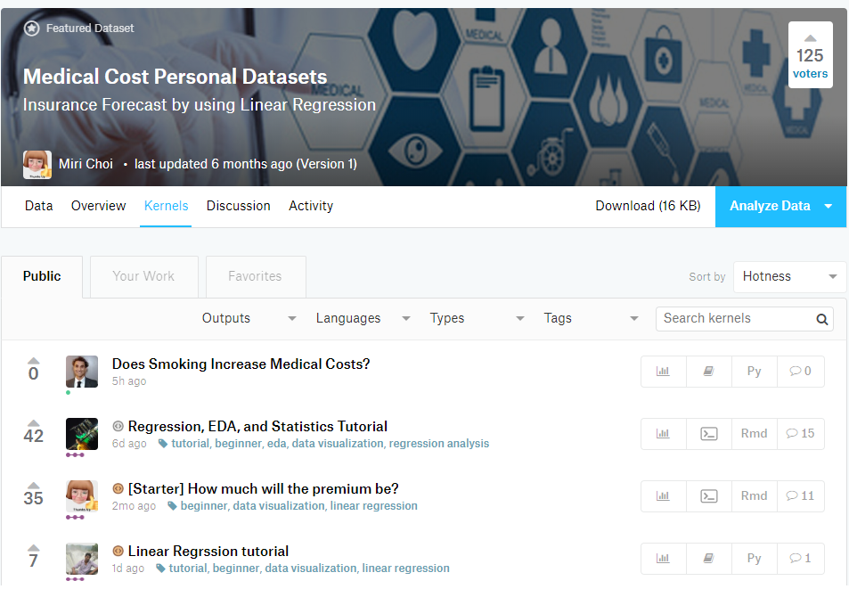
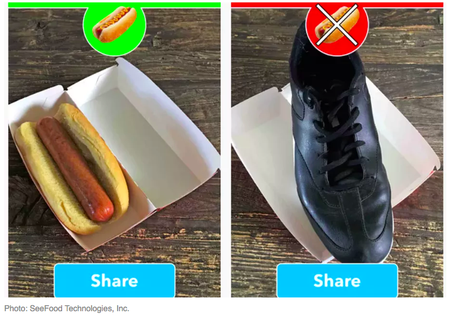
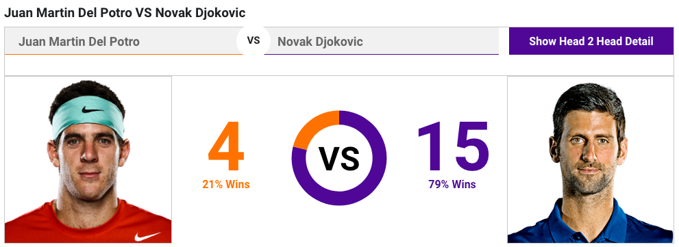

# Reframing Data Science

While everybody's talking about how much of an impact data science will make to their business process, let's admit it, nobody really know what is it about. The thing is, since data science has emerged as a buzzword, nobody created an *official* definition about what it is. Some said they have done data scientist roles since decades ago, some said that it's only capable to be done with the most recent technology. It is actually not about having the right answer, but rather a different idea about what it's really is. Today, I'm not here to give you the *official* answer about what is it, but rather try to reframe data science so we're going to be on the same page for the next hours.


So, this is the favorite way for people to describes what is data science. It's a combination of 3 main elements: computer science, math & statistics, and subject matter expertise. Take away computer science, or data processing technology, you would only get traditional research practice in working with data. Take away math & statistics, you would have a software without accountability in intepreting the data. Take away subject matter expertise, you would take away the initial question data science is meant to answer.  

For me, I'd like to describe data science as a set of process. This is a more tangible way of describing it. Let's take a look at the following image:


1. Ask a question  
2. Collect the data  
3. Explore the data  
4. Model the data  
5. Communicate the result  

There are some of the interesting point in this process alone. We would see that the first question within the process is to actually ask a question. This question would come from subject matter expert side, he/she would be the one to thoroughly understand the main pain point of current subject. It could be people working at bank, is trying to reduce the number of non performing loan so they would like to know how to better identify a person with poor ability to pay. Other cases, it could be  people working in marketing unit, is trying to understand how their campaign is perceived to their target market.  
Next, after a set of questions is set, it is to understand the data point needed to answer the question. This, interestingly came **after** a question is asked, which is in some cases are commonly seen the other way around. Without a business question we're trying to answer, it can be an aimless effort in collecting the data. Sure, a good data scientist can give a good suggestion of what kind of valuable insight they can get from the data, but let's bring back the point that the subject matter expertise is the one with the most understanding of the current business pain point.

## Watch and Learn

With the growing popularity of data science practices across the industry, data science community is growing fast too. There are a lot of reference if you want to see what kind of data is collected and the approach in building machine learning model to answer business questions. One of the most popular dataset repository is [Kaggle](kaggle.com). It is a website that holds various machine learning competition. One of the interesting feature in Kaggle is a feature called Kernel. Kernel is where people can share their findings and exploratory approach from shared public data. On the example below, a dataset is shared that has information regarding a person medical cost, given their family and health condition. This dataset is then taken by some people to solve various questions likes: 'Does smoking increase medical cost' or 'How much will the premium be'. Take a look at one of the approach of data scientists around the world handling the data, and it is a really good practice in kickstarting your data science implementation.  



Other website I really like to go and visit is [UCI Machine Learning](https://archive.ics.uci.edu/ml/). This website holds as datasets repository. The dataset in this website is more industrially specific. While you can get a wide amount of exposure of datasets around the industries, it also give you the information of relevant papers where the data is used. If you have budget for purchasing the paper, UCI Machine Learning can be a very good reference for developing your data science knowledge.

Other website reference is out there and is available for you to get more out of data science. Here are some to get you started with:  

- https://www.r-bloggers.com/  
- https://www.kdnuggets.com/  
- https://www.reddit.com/r/datascience/  

## Machine Learning Questions

Now I've been mentioning *machine learning* for a couple of times. Machine learning refers to a practice of programming a set of rules, without stating it explicitly. This practice involved application of statistical and mathematical methods in order to arrive at a logical set of rules. In a very high level, machine learning problem can be divided into two main groups:  
- *Supervised*  
- Regression  
- Classification  
- *Unsupervised*  
- Dimensionality Reduction  
- Clustering  

Supervised problem focuses on building a predictive modelling for our data. It is done by giving examples of a **correct** answer to our machine and let them try to predict the answer for next set of data. While unsupervised, is mainly used for exploratory data analysis steps, mainly trying to summarize or groups similar data together in order to gain better understanding to our data.




# Scientific Environment for Data Science

Working with data gives you total exposure to business users. Not just you're trying to come up with a clever solution to their problem, but you'll also need to communicate the result in a clear, easy to understand, and accountable in a way that wouldn't give your business user bad market decision. When you come up with a model, try and ask this to yourself: "Is this the best model I can come up with?"

The scary things about data is, the less person understand the nature of their data, the more manipulative data science practice can become. Consider this case:  

> Machine learning model was built to differentiate between benign and malignant cancers. It is measured using various measurements including: radius, texture, and perimeter. Using the past set of data, the model is built to predict which class does the cancer fall on.

A poor understanding of the data would lead to a bad model A wrong prediction could lead to a wrong patient treatment and could further leads to worse state of the patient. Without trying to understand the data and how it is modelled, evaluated, and understood, would lose the accountability needed in implementing the model.

The needs to laid out exploratory analysis and findings of the data, became hugely popular. Tools like Jupyter Notebook or RMarkdown, the one I'm currently using right now, has been a top choice for data scientists. It provides you the tools to analyze, and also a room to describe your findings and also present your model in a somewhat understandable presentation.

There will be several debate about which programming language should we pick up in learning data science. There are many programming language out there used for data analysis, but specifically in this session, we would talk a bit about R. So, why R?

1. **Built by Statistician**   
  One of the special thing about R is, it is programming language that is developed around statistician. It is built from the needs and perspective of a statistician. R is created for the purpose of data analysis and as such, is different in nature from traditional programming languages.  
2. **Libraries**   
  R’s libraries extend R’s graphical abilities, and adds out-of-the-box functionalities for linear and non-linear modeling, statistical tests (confidence tests, P-value, t-test etc), time-series analysis, and various machine learning tasks such as regression algorithms, classification algorithms, and clustering algorithms.  
3. **Open Source**   
   The R community is noted for its active contributions in terms of packages and part of the reason for its active and rapidly growing community is the open-source nature of R. Users can contribute packages – many of which packaged some of the most advanced statistical tools. Even big companies like Google, Twitter, and Facebook has contribute their data analysis libraries to be accessible in R.  
4. **Ready for Big Data**  
  RHadoop, ParallelR, Revolution R Enterprise and a handful of other toolkits adds powerful big data support, allowing data engineers to create custom parallel and distributed algorithms to handle parallel / map-reduce programming in R. This makes R a popular choice for big data analytics and high performance, enterprise-level analytics platform.

# Study Case: Text Mining and Sentiment Analysis  

Ever wonder how does your Gmail put away your spam emails on seperate folder? In this section we would dive in about a simple, yet good method in classifying text data.



I'm sure all of you are familiar with the term probability. It is a common measures if we want to know the likelihood of something happening. Just a few days ago, for you who enjoy tennis, Novak Djokovic won over Juan Martin Del Potro on US Open final. Looking at this head to head statistics provided by ATP World Tour [website](atpworldtour.com), can you interpret how to understand better the concept of probability?  

In the context of events, we would seperate probability into prior and posterior probability. With the help of Naive Bayes theorem (which I won't go to deep in trying to prove the formula), we can calculate posterior probability using prior probability.

$P(A|B) = \frac{P(B|A)P(A)}{P(B)} $

The idea of this formula is: When you already know the prior probability of event B happening given A already happened, you can calculate the probability of event A happening in the future given B happened.

Using the same examples:  
- A: Novak Djokovic win the match  
- B: They are playing in hard court and outdoor  

Knowing the prior probability when they played in hard court and outdoor while Djokovic won. We can calculate the probability of Djokovic win given they play in hard court and outdoor. This formula simplify the `B` conditions because it assume a set of events is independent to each other, which in most cases it doesn't. However, this simplification is proven to be one of the most effective model. You can read the paper [here](http://www.aclweb.org/anthology/P12-2018).  

## Exploratory Data Analysis  

Moving on from Naive Bayes, we're gonna start playing around with a dataset. Dataset we'll be using now is taken from [kaggle](https://www.kaggle.com/nicapotato/womens-ecommerce-clothing-reviews). This dataset contains a set of women clothing reviews in e-commerce. Columns include customer information, review, rating, and item description. Let's load that in.  

```{r}
clothing <- read.csv('data_input/Womens Clothing E-Commerce Reviews.csv', stringsAsFactors = F, na.strings = "")
str(clothing)
```

Working with data, you would encounter a lot of missing data. There are a lot of way to encounter this, but the direct one is to use a complete case analysis on the data. Most of the time, it results in a really small dataset instead, so it might worth the time to do imputation to extrapolate the missing value. For this exercise, we'll do complete case analysis.

```{r}
clothing <- clothing[complete.cases(clothing),]
colSums(is.na(clothing))
```

Next, we can play around a bit with the data. Say I would like to know the general idea of words that person that is satisfied and unsatisfied would say in a review. The review here, would be taken from `Title` column, and the satisfaction would be taken from `Recommended.IND` column.

One of the most common way of visualizing text data is using wordcloud, in R, we have the library ready to use.

```{r, warning=F}
sentiment <- clothing[,c("Title","Recommended.IND")]

library(tm)
library(wordcloud)
library(SnowballC)

pos <- VCorpus(VectorSource(sentiment[sentiment$Recommended.IND==1,"Title"]))
neg <- VCorpus(VectorSource(sentiment[sentiment$Recommended.IND==0,"Title"]))

suppressWarnings(wordcloud(pos,
          min.freq=5,          
          max.words = 200,
          random.order = FALSE,
          colors= brewer.pal(8, "Set2")
          ))

suppressWarnings(wordcloud(neg,
          min.freq=5,          
          max.words = 200,
          random.order = FALSE,
          colors= brewer.pal(8, "Set2")
          ))
```

Other, times, we would like to also explore our data beyond the frequency of each words. Say we would like to know, how is the likeability in each item's category. Can we say that one category is preferrable over the other? To do that, we can do a bit of data manipulation and use `ggplot2` library that is widely used for data visualization.

```{r, warning=F}
library(ggplot2)
library(dplyr)

clothing %>%
  mutate(Department.Name = as.factor(Department.Name)) %>% 
  group_by(Department.Name,Recommended.IND) %>%
  summarise(Sales = n()) %>%
  ggplot(aes(x=Department.Name, y = Sales)) + geom_col(aes(fill=Recommended.IND), position = "fill")

```

What insight can you get?  

While there are still many things that we can explore from our data, I encourage you to take the data home, and see what kind of exploratory data analysis you can came up on your own!

## Building Machine Learning Model  

Continuing from the last part when we talk about probability. The idea of sentiment classification using naive bayes is to calculate the probability of one review being a bad sentiment, given a set of words present in the review.

In working with text data, most of the time we would use either corpus (a set of documents) or document term matrix. There are a lot of text preprocessing that can be done to further improve our data, some are listed on the following chunck.

```{r}
corpus <- VCorpus(VectorSource(sentiment$Title))

corpus[[5]]$content

#remove numbers
corpus <- tm_map(corpus, removeNumbers)

#removing punctuation
corpus <- tm_map(corpus, removePunctuation)

#transform all words into lower case
corpus <- tm_map(corpus, content_transformer(tolower))

#remove stopwords
corpus <- tm_map(corpus, removeWords, stopwords())

#transform all multiple whitespaces into one
corpus <- tm_map(corpus, stripWhitespace)

#document stemming
corpus <- tm_map(corpus, content_transformer(stemDocument))

corpus[[5]]$content
```

Next, in order to ensure that our model is built with some credibility, we would use a cross-validation method that allows us to evaluate our mode. The idea is to split the data into two set: train and test. One shall be used to build the model, and one used to cross-validate the prediction power of the model.

```{r}
set.seed(10)
inrow <- sample(nrow(sentiment),0.8*nrow(sentiment))
train <- corpus[inrow]
test <- corpus[-inrow]
```

A bit of process needed to be done first before fitting in our model. Some of them would be: eliminating words that only appear a few times and transforming the frequency value from numeric into: present or not.

```{r}
freq_terms <- findFreqTerms(DocumentTermMatrix(train),5)

reduced_dtm.train <- DocumentTermMatrix(train, list(dictionary=freq_terms))
reduced_dtm.test <-  DocumentTermMatrix(test, list(dictionary=freq_terms))
```

```{r}
convert_counts <- function(x) {
  x = ifelse(x > 0, 1, 0)
  x = factor(x, levels = c(0, 1), labels=c("No", "Yes"))
  return (x)
}

train.yn <- apply(reduced_dtm.train, MARGIN = 2, convert_counts)
test.yn <- apply(reduced_dtm.test, MARGIN = 2, convert_counts)
```

Lastly, with the help of `e1071` library, we can create a naive bayes model, where we can calculate the needed prior probability we need.

```{r, warning=F}
library(e1071)
classifier <- naiveBayes(train.yn, factor(sentiment[inrow, "Recommended.IND"]))

classifier.pred <- predict(classifier, test.yn, type = "raw")

prediction <- ifelse(classifier.pred[,2] > 0.75, 1, 0)

table(actual=sentiment[-inrow, "Recommended.IND"], prediction=prediction)
```

We see, in the prediction threshold, I actually use 0.75 to be called satisfied. This happens because our data is imbalance. The proportion of review that indicates a recommendation-worthy item is way more than the not recommended one. This results in a *bias* model where a naturally neutral review is automatically considered as recommended, just because it has more data (more information).

Moving the threshold is one solution, but in a very imbalance data, we would want to consider other model that is less influenced by data imbalance. Or, to do under-sampling or over-sampling that can help you optimize the data balance.

## Building Data Product

There are several ways to utilize the models you have already built. You can store your model in a database. Microsoft has an progresive movement towards R community. They even have their own R version, called Microsoft R. This version is built on top of the original R, but was given additional capabilities for scalability. One of the most recent addition is in-database-analytics, where we can run R, from our server using Microsoft SQL Server 2016+. For those of you interested can check the following [link](https://docs.microsoft.com/en-us/sql/advanced-analytics/tutorials/sqldev-in-database-r-for-sql-developers?view=sql-server-2017).

The other is to build a dedicated product or dashboard. R has a web engine library that support web development called `shiny`. This library has growing so popular, you can see other people product in [showmeshiny.com](showmeshiny.com). Using our developed model, we can have something like [this](https://niffadf.shinyapps.io/satisfaction_demo/).

