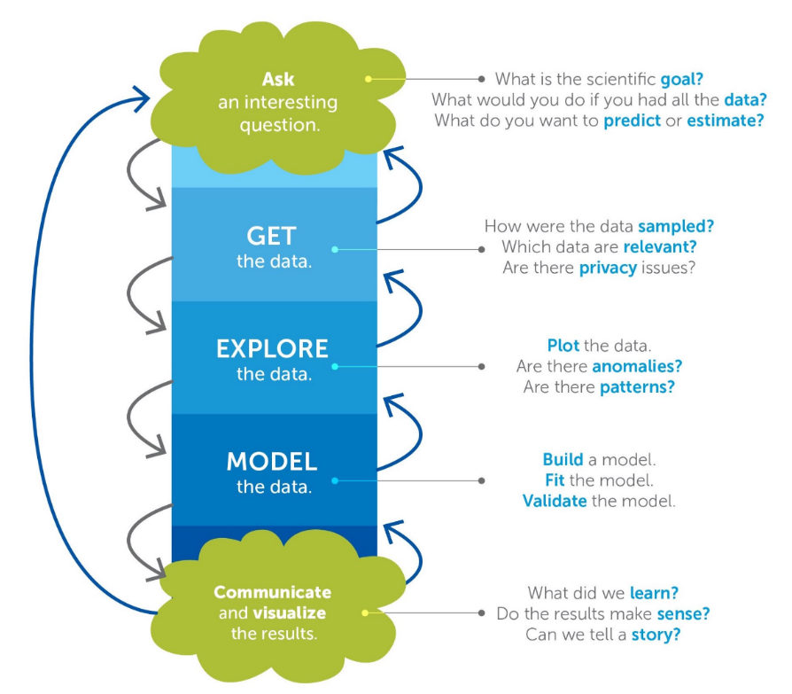
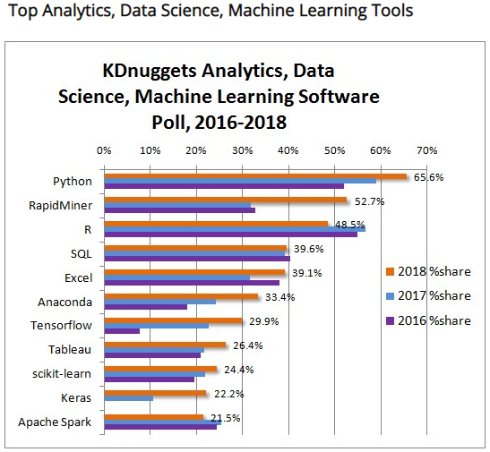

# Background {.tabset}
## Algoritma
The following coursebook is produced by the team at [Algoritma](https://algorit.ma) for Finhacks 2018 Workshop, Jakarta. The coursebook is intended for a restricted audience only, i.e. the individuals and organizations having received this coursebook directly from the training organization. It may not be reproduced, distributed, translated or adapted in any form outside these individuals and organizations without permission. 

Algoritma is a data science education center based in Jakarta. We organize workshops and training programs to help working professionals and students gain mastery in various data science sub-fields: data visualization, machine learning, data modeling, statistical inference etc. 

## Libraries and Setup

In this workshop, we'll be using several packages in R. You will need to use `install.packages()` to install any packages that are not already downloaded onto your machine. After the packages are installed, load the package into your workspace using the `library()` function:

```{r, warning=FALSE}
#install.packages("ggplot2")
library(ggplot2)
library(dplyr) 
library(caret)
library(rpart.plot)
library(ROCR)
```


## Training Objectives
The 3-hours workshop introduces students to the science of building machine learning models that are used to study correlations and making predictions. We will cover some R programming basics given that the course is taught to R beginners. 

- **Reframing Data Science**    
- Data science process  
- Machine learning problems  
- Applications in industries  
- **R Programming Language**  
- Common tools in data science  
- Working with data frame  
- Data analytics tips and tricks  
- **Building Machine Learning Model**  
- Understanding the algorithm  
- Evaluating model performance  

# Data Science 101  

While everybody's talking about how much of an impact data science will make to their business process, let's admit it, nobody really know what is it about. The thing is, since data science has emerged as a buzzword, nobody created an *official* definition about what it is. Some said they have done data scientist job since decades ago, some said that it's only capable to be done with the most recent technology. It is actually not about nobody having the right answer, but rather a different idea about what it's really is. Today, I'm not here to give you the *official* answer about what is it, but rather try to reframe data science so we're going to be on the same page for the next hours.


So, this is the favorite way for people to describes what is data science. It's a combination of 3 main elements: computer science, math & statistics, and subject matter expertise. Take away computer science, or data processing technology, you would only get traditional research practice in working with data. Take away math & statistics, you would have a software without accountability in interpreting the data. Take away subject matter expertise, you would take away the initial question data science is meant to answer.  

For me, I'd like to describe data science as a set of process. This has a more tangible way of describing what is it. Let's take a look at the following image:



1. Ask a question  
2. Collect the data  
3. Explore the data  
4. Model the data  
5. Communicate the result  

There are some of the interesting point in this process alone. We would see that the first question within the process is to actually ask a question. This question would come from subject matter expert side, he/she would be the one to thoroughly understand the main pain point of current subject. It could be people working at bank, is trying to reduce the number of non performing loan so they would like to know how to better identify a person with poor ability to pay. Other cases, it could be  people working in marketing unit, is trying to understand how their campaign is perceived to their target market.  
Next, after a set of questions is set, it is to understand the data point needed to answer the question. This, interestingly came **after** a question is asked, which is in some cases are commonly seen the other way around. Without a business question we're trying to answer, it can be an aimless effort in collecting the data. Sure, a good data scientist can give a good suggestion of what kind of valuable insight they can get from the data, but let's bring back the point that the subject matter expertise is the one with the most understanding of the current business pain point.

In this workshop, we would demonstrate a step by step approach in explore, model, and communicate the result using R programming language. We would use a public dataset with a predetermined business questions we're trying to answer and we would go through the steps of building a machine learning model. But before that, let's dive in to some of industrial examples in the next section.

## Diagnosing Breast Cancer  

A lot of machine learning model is developed to answer medical questions. One of the most famous dataset used in machine learning examples is dataset of cancer observation. The cancer is divided into two class, benign and malignant, and is measured using various measurements including: radius, texture, and perimeter. Using the past set of data, machine learning model is built to be able to predict with known radius, texture, and perimeter, which class does the cancer fall on: benign or malignant. This shows how powerful a machine learning model can be used. It learned the data of cancer attributes that diagnosed as malignant and try to predict future malignant cases early.  

## Customer Churn using RFM Analysis  

One of the analysis used in business sector is called RFM analysis, stands for recency, frequency and monetary. These attributes is used to describe customer's value for a business. A customer might frequently having business with us, but some might have more value for our business in terms of recency and monetary. 

- Recency : How recently did the customer purchase?
- Frequency : How often do they purchase?
- Monetary Value : How much do they spend?

This can be customer's information in detecting early churning. A certain behavior in frequency, recency, and monetary to our business might indicates a customer in a stage of churning. Detecting this earlier could help business to decide whether or not we're trying to keep this customer, or having a new customers.  

## Predicting Crime Rate  

Machine learning has also been used by government in order to forecast future statistical measures to help government anticipate and regulates the growth of a region or country. By identifying the factors that affecting crime rate, the government can understand better sense of what to prepare, what to improve and what to anticipates. This can be a very good example in how we see the predictive power on our model. Sure, it is very valuable for a model to have high reliability on prediction performance, but most of the time, getting the interpretation of how our data behaves stand more importantly than any other outcome.  

# Programming in R  

One of the amusing topics that you might find online is people discussing about which programming language to learn for if you're about to start out as data scientist. In the earlier days of data analysis (earlier here refers to 2014), the most used language for data analysis is: R, Python, SAS and SQL. [ref](https://www.kdnuggets.com/2014/08/four-main-languages-analytics-data-mining-data-science.html) Nowadays, a lot of programming language has evolved into programming language with data analysis capabilities. Let's take a look at the following statistics:



The data seen on the statistics above is collected through KDnugget pools where people vote which data analysis tools they are using inclusively. On average, people are selecting up to 7 tools. We see, indeed there a lot if tools to use when we're talking about data analysis. R, is one of the tools that has very high share, along with Python and Rapidminer. It is indeed one of the most popular tools in working with data. So why R?

1. **Built by Statistician**   
  One of the special thing about R is, it is programming language that is developed around statistician. It is built from the needs and perspective of a statistician. R is created for the purpose of data analysis and as such, is different in nature from traditional programming languages.  
2. **Libraries**   
  R’s libraries extend R’s graphical abilities, and adds out-of-the-box functionalities for linear and non-linear modeling, statistical tests (confidence tests, P-value, t-test etc), time-series analysis, and various machine learning tasks such as regression algorithms, classification algorithms, and clustering algorithms.  
3. **Open Source**   
   The R community is noted for its active contributions in terms of packages and part of the reason for its active and rapidly growing community is the open-source nature of R. Users can contribute packages – many of which packaged some of the most advanced statistical tools. Even big companies like Google, Twitter, and Facebook has contribute their data analysis libraries to be accessible in R.  
4. **Ready for Big Data**  
  RHadoop, ParallelR, Revolution R Enterprise and a handful of other toolkits adds powerful big data support, allowing data engineers to create custom parallel and distributed algorithms to handle parallel / map-reduce programming in R. This makes R a popular choice for big data analytics and high performance, enterprise-level analytics platform.  

## Data Exploratory Tips  

One of the most common form of data is tabular data. You would come across this kind of data anywhere in the industries. This too is commonly form of stored data in a relational database. It consist of two main attributes: rows and columns. In statistics, we usually identify this two attributes as: observations and variables. One observation is stored within one row, and is taken by one or multiple measure(s) or variable(s) that is stored per column.

Before going into creating your machine learning model, getting familiar with your data is really important steps. You can create a machine learning model, without exploring the data, but then you wouldn't understand thoroughly the problem you are trying to solve and would lead you to a model with no accountability.

In this workshop, we would take a look at the data taken from [UCI Machine Learning repository](https://archive.ics.uci.edu/ml/datasets/Absenteeism+at+work) about employees absenteeism at work. This dataset includes interesting set of variables likes time of the absenteeism, reasons, work-related, and personal information. In R, we can use function `read.csv()` to read the data into our environment. After you run the chunk below, you would see a new variable called absent in the environment pane in your right.

```{r}
absent <- read.csv('data_input/absent_cl.csv')
summary(absent)
```

Using `summary()` function we would get a summarized information of our data variables. This function would create the summary for each variable based on the type of the data. For example, in numerical variable, you would automatically get five number summary and its mean, while in categorical variable you would automatically count the number of occurrence of each category.  

On the other hand, some of the data is read as different type of data. For example, the ID variable is supposed to be employees ID, while one employee might have multiple absenteeism occasion. This way, we could see ID as categorical variable. This, also applies for `Reason.for.absence` variable. It is a categorical variable that is decode to numerical variable, but having it as numeric would have differentiate the treatment of our model. I'm going to put the `Reason.for.absence` glossary to refer here.  

(1) Infectious and parasitic diseases  
(2) Neoplasm  
(3) Diseases of the blood  
(4) Endocrine, nutritional, and metabolic diseases  
(5) Mental and behavioral disorders  
(6) Diseases of nervous system  
(7) Diseases of eye    
(8) Diseases of ear  
(9) Diseases of circulatory system  
(10) Diseases of respiratory system  
(11) Diseases of disgestive system  
(12) Diseases of skin  
(13) Diseases of skeletal and joints  
(14) Diseases of genitourinary  
(15) Pregnancy and childbirth  
(16) Perinatal period  
(17) Chromosomal abnormalities  
(18) Abnormal clinical and laboratory findings  
(19) Injury and poisoning  
(20) External causes of morbidity and mortality  
(21) Factors influencing health  
(22) Medical check up  
(23) Medical consultation  
(24) Blood donation  
(25) Laboratory examination  
(26) Unjustified absence  
(27) Physiotherapy  
(28) Dental consultation  

Now, let's transform the incorrect type and count the number of ID occurrence by using `table()` function.

```{r}
absent$ID <- factor(as.character(absent$ID))
absent$Reason.for.absence <- factor(as.character(absent$Reason.for.absence))
absent$Social.drinker <- factor(as.character(absent$Social.drinker))
absent$Social.smoker <- factor(as.character(absent$Social.smoker))


#Counting number of each ID occurence
table(absent$ID)
```
```{r}
library(ggplot2)
ggplot(data=absent, aes(x=ID)) + geom_bar()
ggplot(data=absent, aes(x=Month.of.absence)) + geom_bar()
ggplot(data=absent, aes(x=Education)) + geom_bar()
```

It is simple presentation of our data, but it get us the quick insights of the employees absenteeism. There are one employee with a strange behavior of total 113 occurrence of absenteeism. It's always a good idea to inspect an *anomaly* data and see how can we best address it. I can use the same `table()` function to get each reason occurrences for employee with ID 3.

```{r, echo=FALSE, eval=FALSE}
absent[absent$ID==3,]
```

```{r}
table(absent[absent$ID=="3","Reason.for.absence"])
```

Refers back to the glossary I've provided for you. We see some reasons of the absenteeism. The first reason that was used the most was 27, followed by 28, and 23, Physiotherapy, dental consultation, and medical consultation. A pretty wide variation of reasons, to some occasion, this can introduce a problem, but we shall discuss it in the following section.  

# Building Machine Learning Model  

Machine learning on a very basic level, refers to a sub field of computer science that “gives computer the ability to learn without being explicitly programmed”. Less-sensationally, it is concerned with the theory and application of statistical and mathematical methods to arrive at a particular objective without following a set of strictly defined pre-determined rules.  

The most major usage of machine learning is to create a predictive model. This can be a very powerful tools for a lot of business industries as we have go through on our earlier section. Predictive modelling, in machine learning, refers to the practice of trying to predict future value from a set of known predictors. This, too is further divided into two major prediction capabilities: numerical and categorical.  

Predicting continuous numerical variable problem is commonly known as regression problem, while in predicting discrete variable, it is commonly known as classification problem. Both are widely used in different industries and a lot of business problem are redefined into these problems so that it can be transformed into a predictive model. In this workshop, we would define both problems and see how do we evaluate both models.

Supervised learning vs unsupervised learning
An important categorization in machine learning literature is to identify algorithms by the “signal” we made available to a model.

- Supervised learning: We feed our model training examples (input) and tag each of these example with a corresponding target, and is so doing, allow our model to produce a function that maps our input to its target.

- Unsupervised learning: If we feed our model training examples (input) without any labels, it is unsupervised learning.


## Regression Model  

Remember how regression problem deals with predicting continuous numerical variable? By formulating the business problem into regression problem, we can then start to model our data into a predictive model.  

*"How much hours will an employee spent on absenteeism"*   

This problem can arises from a team manager that is trying to improve its team's works outcome, or HR division that is trying to established a new way to manage and anticipate employee's absenteeism. Recall our data holds a set of interesting variables of employees absenteeism. One of them is the hour each employee spent on absenteeism. Using the other data set, we're trying to model how much a person tends to spend their time in absenteeism.

## Dealing with Missing Values  

One of the initial steps you should take in creating a model is to check for missing values. Missing values is common occurrence in many cases and is one of the things that is faced by data scientists around the world. There are no best way to address this problem, and should be approach by specific to its case. There are three common way of dealing with missing data: imputation, deletion, and full analysis. Imputation means we're trying to fill in the missing values with the estimates value. The simplest form of imputation would be imputation with its mean. Others uses a fancier way of dealing with missing data by making a predictive model for the missing variables. The other way of dealing with missing data is deletion, this needs to be considered carefully because it might introduces a more biased distribution in our data. While on the other hand, imputing it doesn't necessarily gives a better result. Full analysis uses only all information available resulting in fewer observation but less distortion.

In R, missing values is identified with the value `NA`. The missing values might not be automatically detected, we might need to do some manual identifying process. For example, in some records, a missing value is stored as character `-`, `0`, or `none`. There are many more variance of possible missing value, while some function like `read.csv()` give you a nice parameter in providing the dictionary for missing values (`na.strings`), sometimes we would need to manually identify the strings first. This emphasize the needs for data exploratory before going into creating the model.  

Based on the summary of our data shown in earlier section, we need to manually substitute a zero valued `Reason.for.absence` variable with `NA`. Then, to see the amount of missing values in each variable, we would use the combination if `is.na()` and `colSums()` function.

```{r}
absent$Reason.for.absence <- ifelse(absent$Reason.for.absence=="0",NA,absent$Reason.for.absence)
absent$Month.of.absence <- as.integer(absent$Month.of.absence)

colSums(is.na(absent))
```


Here, we see that `Month.of.absence` and `Reason.for.absence` have missing value presented. We can approach this problem with both deletion and imputation approach, but always make sure that every manipulation done to our data set is accountable and understood. For this dataset, I'm using a library called `caret` with `preProcess` function to replace missing value within my dataset.`preProcess` can be used to impute data sets based only on information in the training set. In this case, we'll use `medianImpute`. 
```{r}
preProcValues <- preProcess(absent, method = c("medianImpute"))
absent <- predict(preProcValues, absent)
colSums(is.na(absent))
```
```{r, echo=FALSE}
absent$Month.of.absence<-factor(absent$Month.of.absence, levels=1:12, labels=month.abb) 
```


## Cross Validation  

When creating a model, we should have estimates about how well our predictive model predict unknown value. This way, we will have an estimate of how our model would perform when implemented. The idea of cross validation is to split our dataset into 2 datasets: train and test. Train dataset is used to build our model, while test dataset, as the name suggested, is used for testing and cross validating the performance of our model.  


The variable we're trying to predict, called target variable, will be needed to build our model. The idea of providing the *correct* answer to our model and let them learn is what commonly known as *supervised* machine learning. The prediction result of our model, is then cross validated with the true value of our data. The idea of train-test splitting is to preserves target variable in test data, to be then cross validated with our model's prediction.  

The following code is used to split the data into 80% data to train set and 20% of data to test set.

```{r}
set.seed(100)
inrow <- sample(nrow(absent), 0.8*nrow(absent))
train <- absent[inrow,]
test <- absent[-inrow,]
```

There are no best proportion in splitting the data, the rules of thumb is 80:20 for train:test, but it would be implemented based on the case. For example, in a large dataset, having 75:25 will help to reduce the number of rows needed for model training, therefore reducing model building elapsed time. But then, it is always a good idea to add in more data for our model and the proportion can be adjusted based on that needs.  

There are a lot of model used for regression machine learning. Simplest of regression would be linear regression where the relation between predictors and response is assumed to be linear. In a more complex data, models like random forest, extreme gradient boosting, or neural network can be a better options. In this workshop, we would use library called `caret` to create a random forest model to predict hours of absenteeism for an employee.

```{r}
set.seed(200)
ctrl <- trainControl(method="repeatedcv", number=5, repeats=3)
#ab_forest <- train(Absenteeism.time.in.hours ~ ., data=train, method="rf", trControl = ctrl, importance=T)

#Loading model from previously trained model stored in external file
ab_forest <- readRDS("ab_forest.RDS")

#predict without the true target variable
test$pred <- predict(ab_forest, test[,-21])
```

`caret` is library used for all sort of training machine learning models. It is built with a nice control parameter that can be used to provide the needed cross validation techniques, data resampling, seeds, to even paralellization. The model used is random forest, created with 3 repetition of 5-fold cross validation. Then, we can inspect variable importance of the random forest to validate whether or not it is aligned with our initial understanding of the data.  

```{r}
varImp(ab_forest)
```

One of the measures to calculate performance of regression model is to use root mean square error which is calculated with the following formula:

$RMSE = \sqrt\frac {\Sigma^{n}_{i=1}(y_{i}-\hat y _{i})^{2} }{n}$

```{r}
test$error <- (test$pred - test$Absenteeism.time.in.hours)^2
sqrt(sum(test$error)) / mean(test$Absenteeism.time.in.hours)
```

RMSE is a famous measures because the value is intepretable is commonly expressed as percentage and the value can be read as follows:  

```{r}
ab_forest$results
```

Our model can predict on average 14% error from the real value.

Other way of looking into the error is to inspect a residual plots and look into it until you feel like there's nothing to improve upon your model.

```{r}
plot(rownames(test),test$pred - test$Absenteeism.time.in.hours)
```


## Classification Model

Different than continuous variable target, classification problem deals in predicting a discrete value, most of the time it is a categorical variable. This problem is commonly see to answer business questions like: Will my customer churn? Is this transaction considered a fraud? What risk level does this customers falls into? It is really common to see business problem translated into binomial classification problem (yes/no answer). 


Using our absenteeism dataset, we can create a new question to ask.  

**"Considering absenteeism of an employee can we predict if he/she is a social smoker?"**  

Please do take notes that the question created for the purpose of this workshop might not be completely relevant on the real industrial problem.  

Using similar steps, we're going to create a decision tree for our classification model. Decision tree is one of the famous machine learning model that is popular because of high intepretability of the model. It is easy to understand and gives a good insight in selecting important variable and understanding the groups of our data. The code below is the step in creating the model, still using `caret` library.  

```{r}
set.seed(200)
ctrl <- trainControl(method="repeatedcv", number=5, repeats=3)
ab_tree <- train(Social.smoker ~ ., data=train[,-1], method="rpart", trControl = ctrl)

rpart.plot(ab_tree$finalModel)
```

Algorithm used in building this decision tree is called `rpart`, it creates a set of rules to split our data into homogeneous groups and use the majority class of the group for classification purposes. One of the reasons why decision tree is highly popular is that it is able to be presented on a nice plot like the upper one. In this set of rules, the variables used to classified if an employee a social smoker or not is its BMI, age, weight, and distance to work. Please do not the removal of ID variables is done for the sake of better model.  

## Classification Cross Validation Measures  

Cross validating in classification also holds an essential part in evaluating the model. The steps of cross validation is the same as regression, is to split the data into train and test, where test acted as unseen data for the model. Using `caret` decision tree, we can use `predict()` with `type` parameter to get the probability prediction.

```{r}
pred.smoke <- predict(ab_tree, test[,-16], type = "prob")

table(Actual = test$Social.smoker, Prediction = ifelse(pred.smoke$`1`>0.5,1,0))
```

In classification, you need to be really familiar with confusion matrix. The table above is the cross tabulation between prediction and actual class of our target variable. It divides it into 4 quadrant: upper left (True Negative), upper right (False Positive), bottom left (False Negative), and bottom right (True Positive). It is a common measure for binary classification. First, it needs to identify the *positive* class that we're trying to predict, in this case is whether or not an employee is a social smoker.  

After having each of the 4 measures, the next thing to pay attention to is know the *accuracy*, *recall*, and *precision* of our model. Three of them holds a crucial steps in defining model. 

```{r}
#Accuracy
(130+12)/(130+3+3+12)
#Recall
11/(11+4)
#Precision
11(11+3)
```

While accuracy, recall, and precision can give you basic idea about how well your classification model's reliability, there are other measures called receiver operating characteristics curve. It is created by plotting true positive rate and false positive rate at various thresholds setting. In previous section, you would see me using 0.5 as my threshold, means anything classified with the probability beyond 0.5 is identified as the class `1`. This, might not also be the case, in a model with imbalanced data, or any other biased data, there are several ways in establishing a threshold.  

ROC curves [ref](http://navan.name/roc/), plot true positive rate and false positive rate to see which of our model performs better in terms of class distribution. In using this measure, the area under the curve (AUC) is commonly used to compares machine learning models to see which can generate a better probability to classify the positive, rather than negative class (assuming classifying positive is better than negative).  

In R, the library used to calculate this is called `ROCR` and can be done with the following code.  

```{r}
pred.rocr <- prediction(pred.smoke$`1`, test$Social.smoker)
perf <- performance(pred.rocr,"tpr","fpr")

plot(perf, colorize=T)

auc_ROCR <- performance(pred.rocr, measure = "auc")
auc_ROCR@y.values[[1]]
```

# Closing Remarks  

This workshop is made for a hands on experience in approaching a machine learning problem. There are a lot of way to approach a problem and we should never expect a *best* way of approach, instead, take your time to actually know and understand your data and model to create an accountable and performing model. Congratulation on making it until the end of this material, I really hope a lot of things in this workshop can be applied to produce a high quality result on your work. I hope you enjoy the session and see you on next occasion!  
